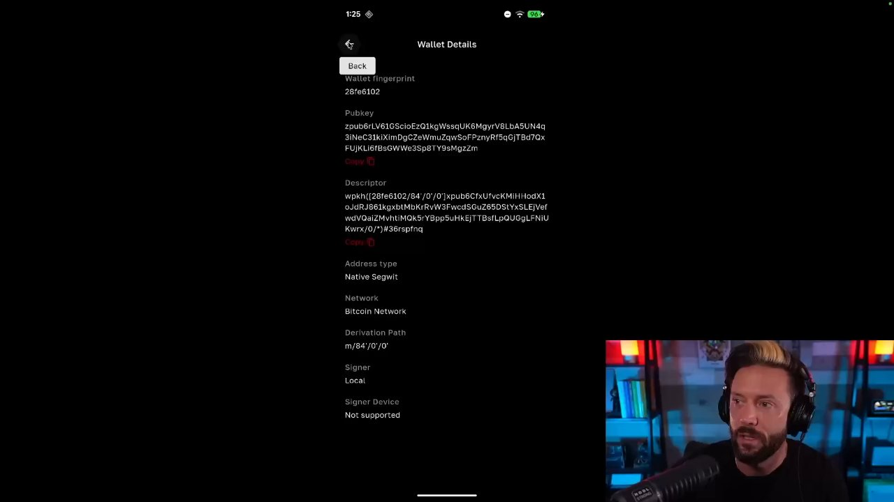
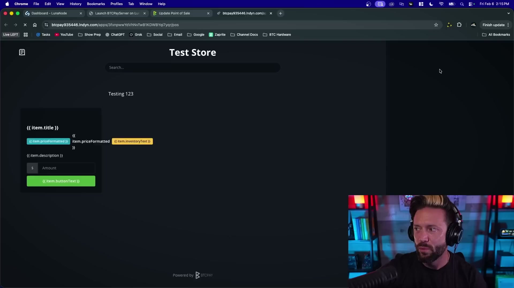

# BTCPay Server Setup: Complete Merchant Guide
*Self-hosted Bitcoin payments with on-chain, Lightning, and Liquid swaps*

---

## Overview

This guide walks you through setting up a **self-hosted Bitcoin payment processor** using BTCPay Server. By the end, you'll accept Bitcoin payments (on-chain and Lightning) with automatic conversion to the Liquid sidechain for faster settlements.

**What you'll build:**
- Non-custodial payment processor (you control funds)
- On-chain Bitcoin payments with invoice management
- Lightning Network payments (instant, low fees)
- Automatic conversion to Liquid sidechain via Boltz plugin
- Custom store, donation page, and point-of-sale interface

**Prerequisites:** Basic computer skills, familiarity with Bitcoin wallets

**Total setup time:** 2-3 hours

**Monthly cost:** ~$15.80 (VPS hosting via LunaNode, payable in Bitcoin)

---

## Architecture

| Component | Purpose |
|-----------|---------|
| **LunaNode** | VPS hosting for BTCPay Server |
| **Bull Bitcoin** | Self-custody wallet (Canadian, supports Liquid) |
| **BTCPay Server** | Open-source payment processor |
| **Boltz Plugin** | Automatic submarine swaps to Liquid |

---

## Step 1: LunaNode Setup

### 1.1 Create LunaNode Account

1. Visit [lunanode.com](https://www.lunanode.com)
2. Create account and add funds (accepts Bitcoin)
3. Navigate to **API** section

### 1.2 Deploy BTCPay Server

1. Go to: [launchbtcpay.lunanode.com](https://launchbtcpay.lunanode.com)
2. Create API keys in your LunaNode dashboard
3. Enter **API ID** and **API Key** in the launcher
4. Click **Continue** — LunaNode deploys a pre-configured VM (~$15.80/month)
5. Save the server IP address provided

### 1.3 Access BTCPay Dashboard

1. Open browser: `http://YOUR-SERVER-IP`
2. Create admin account
3. You're now in the BTCPay dashboard

---

## Step 2: Bull Bitcoin Wallet Setup

### 2.1 Create Wallet

1. Download Bull Bitcoin wallet from [wallet.bullbitcoin.com](https://wallet.bullbitcoin.com)
2. Sign up at [app.bullbitcoin.com](https://app.bullbitcoin.com/registration/850620951575217852985155561438083230402263)
3. Create a new wallet

### 2.2 Get Extended Public Key (xpub)

1. Go to **Wallet Settings** → **Advanced**
2. Note:
   - **Extended Public Key (xpub)** — used for generating receiving addresses
   - **Derivation Path:** `m/84'/0'/0'` (Native SegWit)
   - **Address Type:** Native SegWit (bc1... addresses)

### 2.3 Connect to BTCPay

1. In BTCPay: **Stores → Settings → Wallet**
2. Click **Setup wallet**
3. Choose **Enter extended public key manually**
4. Paste your xpub and confirm derivation path
5. Save

**Resources:**
- [Bull Wallet Tutorial](https://youtu.be/s4fbc9naWj4)
- [Bull Bitcoin Signup](https://app.bullbitcoin.com/registration/850620951575217852985155561438083230402263)

---

## Step 3: Create Your Store

### 3.1 Basic Setup

1. **Stores → Create Store**
2. **Name:** Your business name
3. **Default Currency:** USD
4. **Price Source:** Kraken (or preferred exchange)

### 3.2 Configure Checkout Experience

1. Go to **Checkout Experience**
2. Set payment thresholds:
   - **Lightning (BTC-LN):** For payments > $6.15
   - **On-chain (BTC-CHAIN):** For payments > $25
3. Customize appearance:
   - Show timer for invoice expiration
   - Display amounts in Satoshis (optional)
   - Enable "Pay in wallet" button

### 3.3 Test Invoice

1. **Stores → Invoices → Create**
2. Enter amount and description
3. Share invoice URL or QR code with customer
4. Customer pays via Bitcoin wallet

---

## Step 4: Lightning Network Setup

### 4.1 Enable Lightning Node

1. **Stores → Settings → Lightning**
2. Click **Setup Lightning node**
3. Choose implementation:
   - **LND** (most common, recommended)
   - **Core Lightning (CLN)**
4. BTCPay creates and manages the node automatically

> **Screenshot needed:** Lightning settings page showing LND/CLN selection

### 4.2 Get Inbound Liquidity

Lightning requires **inbound liquidity** to receive payments:

**Options:**
1. **Open a channel:** Deposit Bitcoin to open a payment channel ($100-500 recommended for merchants)
2. **Buy liquidity:** Use services like LNBIG or LightningPool
3. **Request inbound:** Ask partners to open channels to you

### 4.3 Test Lightning Payments

1. Create a test invoice in BTCPay
2. Pay with any Lightning wallet (Bull Bitcoin, Phoenix, Breez)
3. Payment confirms instantly

**Key Concept:** Lightning = instant, low fees, but requires channel liquidity. On-chain = any amount, 10-60 min confirmation.

---

## Step 5: Boltz Plugin — Automatic Liquid Swaps

### 5.1 Why Liquid?

- **1-minute blocks** vs. 10-minute Bitcoin blocks
- **Lower fees** for small frequent payments
- **Confidential Transactions** hide amounts
- **Interoperability:** Swap back to Bitcoin anytime

### 5.2 Install & Configure

> **Screenshot needed:** Boltz plugin settings showing automatic swap configuration

1. **Server Settings → Plugins**
2. Search **"Boltz"** and install **Boltz Client Plugin**
3. Restart BTCPay if required
4. **Stores → Boltz:**
   - Enable **Automatic Swaps**
   - Set minimum swap: 0.001 BTC (~$50)
   - Set maximum swap: 0.1 BTC (~$5,000)
   - Target: Liquid sidechain

### 5.3 How It Works

When you receive a Lightning payment above your threshold:
1. Boltz automatically swaps it to Liquid
2. Funds appear in Liquid wallet within minutes
3. You hold Liquid L-BTC (1:1 pegged to Bitcoin)

**Resource:** [Boltz Exchange](https://boltz.exchange)

---

## Step 6: Point of Sale & Customization

### 6.1 Store Branding

1. **Stores → Settings → Checkout Appearance**
2. Upload logo and set brand colors
3. Add custom CSS (optional)

### 6.2 Create Products

1. **Products → Create Product**
2. Add name, description, price, image
3. Enable inventory tracking if needed

### 6.3 Point of Sale (POS)

1. **Apps → Point of Sale**
2. Create new POS instance
3. Add products to categories
4. Configure quick-tap buttons for common amounts
5. Bookmark the POS URL for retail use

### 6.4 Donation Page

1. **Apps → Crowdfund**
2. Create campaign with goal (optional)
3. Customize messaging
4. Share donation URL

---

## Security & Best Practices

### Backup Checklist

- [ ] **Wallet seed phrase:** Write down Bull Bitcoin recovery phrase
- [ ] **BTCPay backup:** Server Settings → Maintenance → Backup
- [ ] **Lightning backup:** Export channel state regularly

### Security Settings

- [ ] Change default admin password
- [ ] Enable 2FA (Two-Factor Authentication)
- [ ] Configure email notifications for payments
- [ ] Set up webhook alerts (optional)

---

## Quick Reference

| Task | Menu Path |
|------|-----------|
| Create invoice | Stores → Invoices → Create |
| View payments | Stores → Invoices |
| Add product | Stores → Products → Create |
| Configure Lightning | Stores → Settings → Lightning |
| POS interface | Apps → Point of Sale |
| Backup data | Server Settings → Maintenance |

---

## Resources

**Official Documentation:**
- [BTCPay Docs](https://docs.btcpayserver.org)
- [LunaNode BTCPay Guide](https://www.lunanode.com/guides/btcpay)

**Video Tutorials:**
- [Main BTCPay Tutorial](https://www.youtube.com/watch?v=4boOmhAB3bo)
- [Bull Wallet Tutorial](https://youtu.be/s4fbc9naWj4)
- [Coldcard Integration](https://youtu.be/InDyHPcgNdk)

**Support:**
- [BTCMentor](https://btcmentor.io) — One-on-one help
- [BTCPay Telegram](https://t.me/btcpayserver) — Community support

**Hardware Wallets:**
- [Buy Coldcard](https://qrco.de/bfiDBV)
- [Coldcard Tutorial](https://youtu.be/InDyHPcgNdk)

---

*Based on BTC Sessions tutorial. Last updated: February 2026*
